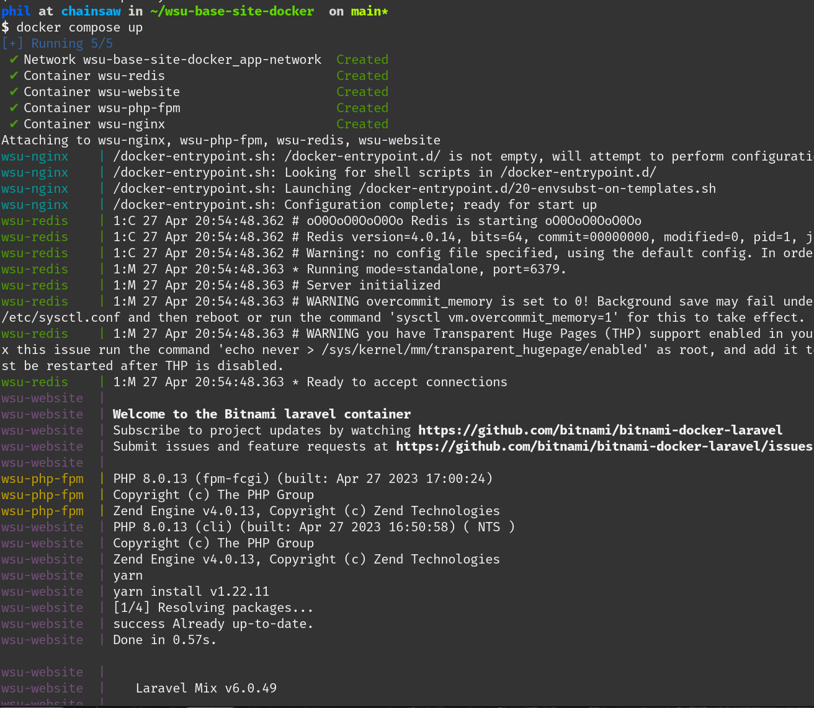
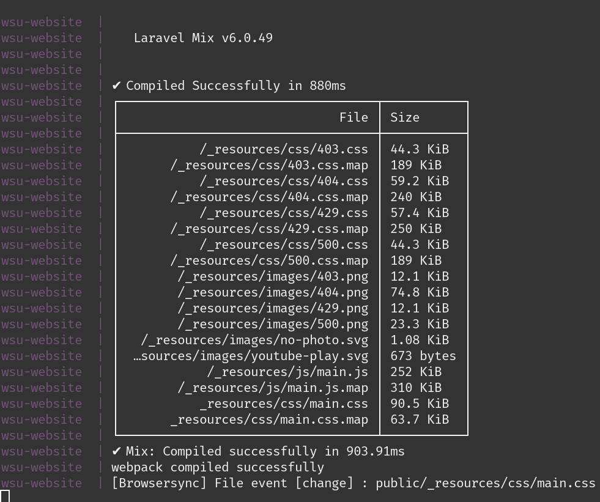

# Overview





# How to use this stuff
Pull down the Wayne State University `base-site` repository inside of _this_ repository i.e.
```
git clone https://github.com/pgporada/wsu-base-site-docker
cd wsu-base-site-docker
git clone https://github.com/waynestate/base-site
cp base-site/.env.example base-site/.env
sed -i.bak -E 's/^REDIS_HOST=localhost$/REDIS_HOST=wsu-redis/' base-site/.env
```

Run the containers or shut them down
```
docker compose up
docker compose down
```

Now, do development work locally on your machine and watch as the changes are reflected in the docker container and via the `make watch` command.

To view running container information:
```
docker ps
```

To see what containers are downloaded on your machine:
```
docker images
```

To access a container, keep in mine that ports are mapped `LOCAL:REMOTE` meaning that `0.0.0.0:32678:3000` means you can access `localhost:32678` in a web browser and traffic destined for there will be sent to port 3000/tcp inside the container.

# Building a new container
The first time you run the build, PHP and PHP-FPM will be compiled based on the version of PHP stored in `./base-site/.phpbrewrc` which can take upwards of 20 minutes on a `11th Gen Intel(R) Core(TM) i7-1165G7 @ 2.80GHz`. Subsequent runs of build will take seconds because of how container layer caching works.
```
./build.sh

docker tag wsu-base-container pgporada/php:8.0.13
docker push pgporada/php:8.0.13
```

# DNS Setup and Considerations
[Base](https://github.com/waynestate/base-site) has many references to `.wayne.local`. The `.local` suffix is specifically intended for mDNS per [RFC 6762](https://datatracker.ietf.org/doc/html/rfc6762#section-3) which means that base is _doing the wrong thing_, but it's been in use for so long that changing habits is more difficult than pushing a boulder up a mountain so what do we do? Well, if we were to change, the `.localhost` domain will **always** resolve to the loopback address (typically 127.0.0.1 or ::1) depending on IPv4/IPv6 per [RFC 6761](https://www.rfc-editor.org/rfc/rfc6761.html#section-6.3). Alternatively, a developer runs a local DNS server that will resolve `*.local` addresses. Examples of this in the past would be using `vagrant-dns` and `NetworkManager` which both use `dnsmasq` under the hood.

## Setup
### Ubuntu (Linux)

Stop the avahi-daemon so that `systemd-resolved` will no longer respond to mDNS requests. This has the downside of you not being able to control a Chromecast or whatever from your computer. You'll be able to work on Wayne State websites so, so that's a cool trade-off I guess? This will also stop you from using systemd-resolved because as far as I can tell, it's not possible to make it work with systemd-resolved.
```
$ sudo systemctl stop avahi-daemon.socket
$ sudo systemctl mask avahi-daemon.socket
$ sudo systemctl stop avahi-daemon.service
$ sudo systemctl mask avahi-daemon.service
$ sudo systemctl stop systemd-resolved
$ sudo systemctl mask systemd-resolved

$ sudo netstat -plunt | grep dnsmasq
tcp        0      0 127.0.1.1:53            0.0.0.0:*               LISTEN      40977/dnsmasq
udp        0      0 127.0.1.1:53            0.0.0.0:*                           40977/dnsmasq

$ cat /etc/NetworkManager/dnsmasq.d/local.conf
address=/local/127.0.0.1

$ cat /etc/resolv.conf  | grep -v '^#'
nameserver 127.0.1.1
options edns0 trust-ad

$ sudo systemctl restart NetworkManager
$ systemctl status NetworkManager

$ dig whatever.wayne.local +short
127.0.0.1

$ dig base.local +short
127.0.0.1
```

### OSX
More to come.

# Understanding Routing
The gist of how Traefik is performing routing for this project is:
```
[you] ---start docker-compose--->
  [traefik] --->detect docker-compose service names and dynamically generate routes--->
    [you] ---web request on port 80 for base.local--->
      [traefik] ---route your request to the container with servicc name "base" -->
        [nginx] --->reverse proxy over to php-fpm --->
          [php-fpm] --->render the php and return it back up the stack to you, the client
```

What this looks like in the `docker-compose.yml` file is the following. The service name is the 2nd level identation, in this case it would be `base` and `traefik`. It's important to note here that we're calling nginx "base" because nginx is also performing routing/reverse proxying over to the actual php content we care about. The routes are dynamically being added by traefik because of a `defaultRule` which uses some crazy complex Go templating exposed by Docker.
```
service:
  base:
    image: ubuntu/nginx:latest
    labels:
      - "traefik.enable=true"

  traefik:
    command:
      - "--api.insecure=true"
      - "--entrypoints.web.address=:80"
      - "--providers.docker=true"
      - "--providers.docker.exposedbydefault=false"
      - '--providers.docker.defaultRule=Host(`{{ index .Labels "com.docker.compose.service" }}.local`)'
    labels:
      - 'traefik.http.services.traefik-traefik.loadBalancer.server.port=8080'
      - 'traefik.enable=true'
```

If instead we want an artisanally crafted set of routing rules, we can define them manually on each container as follows and name the routing rule whatever we wanted. This is probably what I would do in a staging or production environment rather than the magic defaultRule.
```
  nginx:
    labels:
      - "traefik.enable=true"
      - "traefik.http.routers.wsu-base.rule=Host(`base.local`)"
      - "traefik.http.services.wsu-base.loadbalancer.server.port=80"
```

We're using Nginx to reverse proxy all traffic intended for `.php` files to a specific php-fpm container. Nginx needs to do this because it does not have a FastCGI handler built in, unlike Apache which does.

# Additional reading
https://gist.github.com/soifou/404b4403b370b6203e6d145ba9846fcc

https://github.com/nickdenardis/docker-php

https://blog.joshwalsh.me/docker-nginx-php-fpm/

https://aschmelyun.com/blog/fixing-permissions-issues-with-docker-compose-and-php/

https://www.digitalocean.com/community/tutorials/how-to-set-up-laravel-nginx-and-mysql-with-docker-compose-on-ubuntu-20-04

[Setting up Traefik with dnsmasq or NetworkManager](https://www.adaltas.com/en/2022/11/17/traefik-docker-dnsmasq/)
